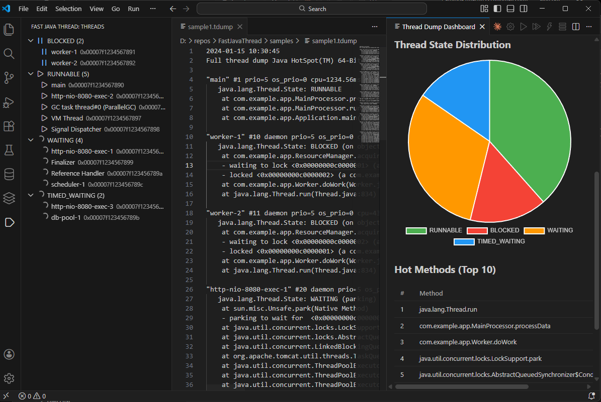

# Fast Java Thread

VS Code extension for analyzing JVM thread dumps (`.tdump` files).


## Features

- **Tree View Sidebar** — Threads grouped by state (RUNNABLE, BLOCKED, WAITING, etc.) with counts and icons
- **Dashboard** — Pie chart of thread states, top 10 hot methods, deadlock alerts
- **Click-to-Navigate** — Click a thread in the tree to jump to its location in the dump file
- **Deadlock Detection** — Automatic cycle detection in lock wait graphs
- **Java 8 & 11+ Support** — Parses both formats (with and without `cpu=`/`elapsed=` fields)

## Screenshots



## Usage

1. Open a `.tdump` file in VS Code
2. The tree view populates automatically in the **Fast Java Thread** sidebar
3. Right-click in the editor and select **Analyze Thread Dump** for full analysis
4. Run **Fast Java Thread: Show Dashboard** from the command palette for the webview dashboard

## Commands

| Command | Description |
|---------|-------------|
| `Fast Java Thread: Analyze Thread Dump` | Parse the active .tdump file and populate the tree view |
| `Fast Java Thread: Show Dashboard` | Open the webview dashboard with charts and deadlock alerts |

## Development

```bash
npm install
npm run compile
npm test
```

Press **F5** in VS Code to launch the Extension Development Host.

## File Format

The extension expects `.tdump` files containing standard JVM thread dump output, as produced by `jstack`, `kill -3`, or JMX `ThreadMXBean.dumpAllThreads()`.
